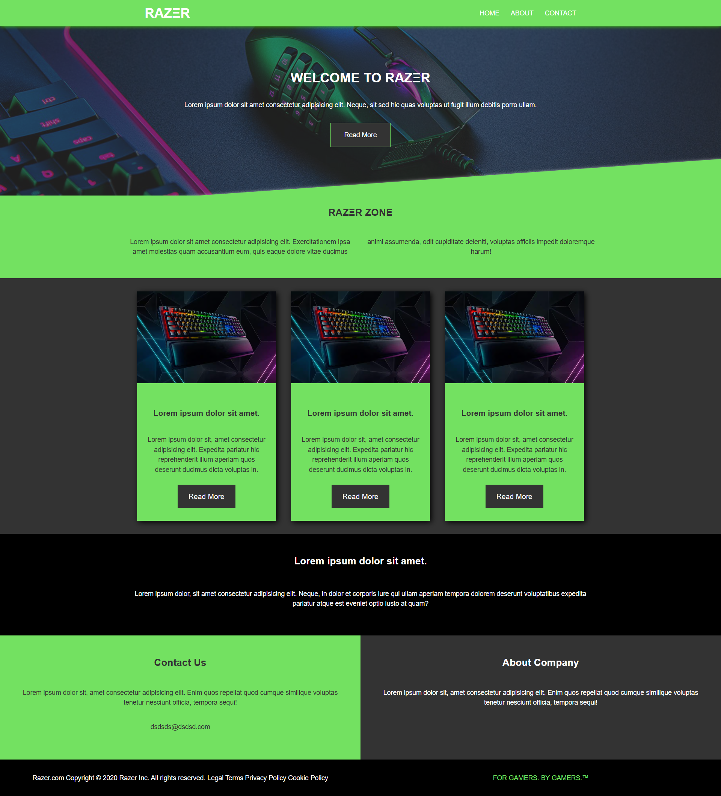

# 🖱️ Razer Website Clone

A single-page static Razer landing page, created as an assignment during a front-end development bootcamp to practice HTML and CSS layout and styling.

## 📝 Project Description

The goal of this project was to recreate a static version of a Razer-like UI based on a given design reference (see below). 

No JavaScript was used — the focus was on visual accuracy and layout structure.

## 🛠️ Technologies Used

- HTML5
- CSS3

## 🎨 Design Reference

The project was built based on the following reference image (provided by the instructor):

## 📸 Screenshots (My Version)

|  |

## 🚀 Live Demo

[🔗 View Live Demo](https://razer-website-clone.netlify.app)

## 👩‍💻 Author

**[Lito Karageorgou]** – Junior Front-End Developer 
📫 Contact: [lito.karageorgou@yahoo.com]  
🔗 GitHub: [https://github.com/LitoKarageorgou?tab=repositories]
